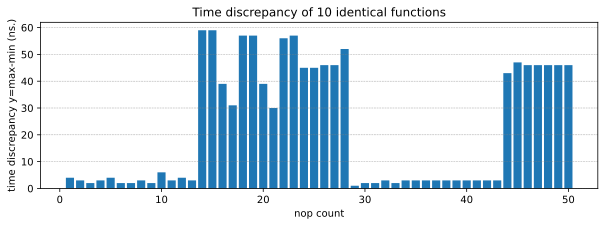
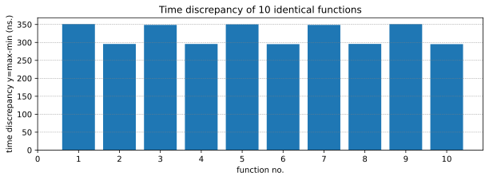
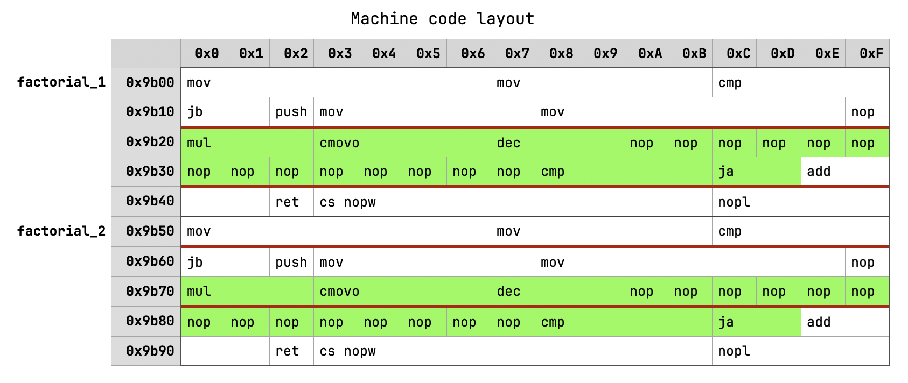

## Introduction

> Good weather is specific weather. Conclusion: there is no such thing as good weather.
>
> _Pilot's proverb_

**TLDR:** The same code placed at different addresses can have varying performance.

As software developers, we often assume that the performance of a specific piece of code is determined solely by the code itself and the hardware it runs on. This assumption gives us a sense of control when optimizing code for better performance. While this assumption holds true in most cases, this article aims to explore phenomena that challenge this notion of control. Additionally, I will provide a [sandbox][github] to demonstrate this phenomenon using the Rust programming language.

## Why Care?

Aligning code can result in significant performance differences, ranging from 5% to 20% (in extreme cases, even up to 30%). Surprisingly, these differences may not always be attributable to changes made directly within the code. It's crucial to exercise caution and verify results to avoid falling into the trap of false optimizations and what are known as "performance swings." I'll demonstrate how you can easily determine if this is the case.

I've encountered some peculiar scenarios where simply changing the order of function definitions in the source code resulted in a 10% performance improvement. However, this improvement often dissipates after making other seemingly unrelated changes to the source code.

## Experimental Setup

Let's put the hardware to work, shall we? We will start with simple iterative factorial computation:

```rust
fn factorial(mut n: u64) -> u64 {
    let mut m = 1u64;
    while n > 1 {
        m = m.saturating_mul(n);
        n -= 1;
    }
    m
}
```

Then we need a macro that will produce a given amount of `nop` instructions at compile time. So if compiled with `NOP_COUNT=3`, it will produce:

```rust
std::arch::asm! { "nop", "nop", "nop" }
```

We will use this macro inside a loop in the `factorial()` function. This way we can (1) precisely control the loop length and (2) align subsequent functions to different 16-byte boundaries (the default alignment for functions on x86).

```rust
fn factorial(mut n: u64) -> u64 {
    let mut m = 1u64;
    while n > 1 {
        m = m.saturating_mul(n);
        n -= 1;
        unsafe {
            __asm_nops();
        }
    }
    m
}
```

Now we need a way to produce 10 identical factorial functions. There are some [shenanigans][shenanigans] required to get the job done, but in the end, we have an executable with 10 duplicates of the same function:

```console
$ nm target/release/same-code-different-performance | grep factorial | rustfilt
0000000000009b00 t same_code_different_performance::factorial_1
0000000000009b50 t same_code_different_performance::factorial_2
0000000000009ba0 t same_code_different_performance::factorial_3
0000000000009bf0 t same_code_different_performance::factorial_4
0000000000009c40 t same_code_different_performance::factorial_5
0000000000009c90 t same_code_different_performance::factorial_6
0000000000009ce0 t same_code_different_performance::factorial_7
0000000000009d30 t same_code_different_performance::factorial_8
0000000000009d80 t same_code_different_performance::factorial_9
0000000000009dd0 t same_code_different_performance::factorial_10
```

Note that all odd `factorial_*()` functions have even addresses. This detail will become important later.

Then I wrote a simple function that measures the performance of those 10 duplicates and produces an output with the difference between the slowest and fastest function.

In theory, there should be no difference in the performance of those functions. After all, they are identical and differ only in function address (you can easily verify this using `objdump --disassemble-symbols=[FN] [BIN]`).

## Empirical Data

To gauge performance, I measured the performance gap between the slowest and fastest functions across 10 duplicates (max-min). The following results are from an AWS `c1.medium` instance equipped with a `Xeon E5 2651` processor.

```console
$ ./run
NOP_COUNT=1 max-min difference = 4
NOP_COUNT=2 max-min difference = 3
NOP_COUNT=3 max-min difference = 2
NOP_COUNT=4 max-min difference = 3
NOP_COUNT=5 max-min difference = 4
NOP_COUNT=6 max-min difference = 2
NOP_COUNT=7 max-min difference = 2
NOP_COUNT=8 max-min difference = 3
NOP_COUNT=9 max-min difference = 2
NOP_COUNT=10 max-min difference = 6
NOP_COUNT=11 max-min difference = 3
NOP_COUNT=12 max-min difference = 4
NOP_COUNT=13 max-min difference = 3
NOP_COUNT=14 max-min difference = 59
NOP_COUNT=15 max-min difference = 59
NOP_COUNT=16 max-min difference = 39
NOP_COUNT=17 max-min difference = 31
NOP_COUNT=18 max-min difference = 57
NOP_COUNT=19 max-min difference = 57
NOP_COUNT=20 max-min difference = 39
NOP_COUNT=21 max-min difference = 30
NOP_COUNT=22 max-min difference = 56
NOP_COUNT=23 max-min difference = 57
NOP_COUNT=24 max-min difference = 45
NOP_COUNT=25 max-min difference = 45
NOP_COUNT=26 max-min difference = 46
NOP_COUNT=27 max-min difference = 46
NOP_COUNT=28 max-min difference = 52
NOP_COUNT=29 max-min difference = 1
NOP_COUNT=30 max-min difference = 2
NOP_COUNT=31 max-min difference = 2
NOP_COUNT=32 max-min difference = 3
NOP_COUNT=33 max-min difference = 2
NOP_COUNT=34 max-min difference = 3
NOP_COUNT=35 max-min difference = 3
NOP_COUNT=36 max-min difference = 3
NOP_COUNT=37 max-min difference = 3
NOP_COUNT=38 max-min difference = 3
NOP_COUNT=39 max-min difference = 3
NOP_COUNT=40 max-min difference = 3
NOP_COUNT=41 max-min difference = 3
NOP_COUNT=42 max-min difference = 3
NOP_COUNT=43 max-min difference = 3
NOP_COUNT=44 max-min difference = 43
NOP_COUNT=45 max-min difference = 47
NOP_COUNT=46 max-min difference = 46
NOP_COUNT=47 max-min difference = 46
NOP_COUNT=48 max-min difference = 46
NOP_COUNT=49 max-min difference = 46
NOP_COUNT=50 max-min difference = 46
```



These results indicate that typically, the discrepancy is under 5ns. However, for NOP counts 14-28 and 44-50, there exists a 30-50ns difference per invocation between the slowest and fastest function.

Now, let's delve into the difference between individual functions for a specific value of `NOP_COUNT=14`.

```console
$ NOP_COUNT=14 cargo run --release 2>&1 | sort
factorial_1 = 356
factorial_2 = 302
factorial_3 = 354
factorial_4 = 297
factorial_5 = 356
factorial_6 = 302
factorial_7 = 354
factorial_8 = 297
factorial_9 = 356
factorial_10 = 302
```



Do you notice the pattern? Essentially, all even functions are fast, while all odd ones are slow. These results are remarkably stable and reproducible, even with the criterion[^criterion]:

```console
$ NOP_COUNT=14 cargo run --release --features=criterion -- --bench
factorials/1  time:   [351.05 ns 351.14 ns 351.23 ns]
factorials/2  time:   [295.58 ns 295.69 ns 295.92 ns]
factorials/3  time:   [348.73 ns 348.80 ns 348.88 ns]
factorials/4  time:   [295.61 ns 295.66 ns 295.71 ns]
factorials/5  time:   [350.39 ns 350.44 ns 350.51 ns]
factorials/6  time:   [295.16 ns 295.25 ns 295.38 ns]
factorials/7  time:   [348.79 ns 348.85 ns 348.91 ns]
factorials/8  time:   [295.70 ns 295.79 ns 295.92 ns]
factorials/9  time:   [351.01 ns 351.07 ns 351.14 ns]
factorials/10 time:   [295.17 ns 295.22 ns 295.26 ns]
```

## Why Does it Happen?

In short, the compiler's machine code often lacks optimal alignment for micro-op caching, resulting in a phenomenon known as DSB thrashing.

I won't delve deeply into Intel microarchitectures here. Instead, I'll explain the issue as simply as possible. If you're interested in learning more about Intel CPU decoding pipelines, I recommend further reading[^code-align] [^ansari] [^agner] [^sandy-bridge].

CPU can be separated into two parts: frontend and backend. The backend is where the real work happens. The primary responsibility of the frontend is to decode the instruction stream and maintain a steady flow of micro-operations (μops) to ensure the backend remains fully utilized. Without a capable frontend, even the most powerful out-of-order execution CPUs would yield subpar performance. Intel mainstream CPUs rely on three components for this: MITE[^mite], LSD[^lsd], and DSB[^dsb].

MITE serves as the instruction decoder, while LSD and DSB together act as a μop-cache. They store the results of decoding individual instructions into micro-operations for CPU execution. When a μop is delivered by LSD/DSB, the decoder engine (MITE) doesn't need to fetch and decode instructions again. This mechanism is particularly effective for frequently used code segments like hot loops and frequently called functions.

Both LSD and DSB have limitations regarding the number and type of μops they can store, as well as the alignment of instructions[^dsb-algo]. However, for Sandy Bridge CPUs, there's one crucial restriction: only 18 μop can be cached for every 32-byte aligned window of instructions[^ansari]. Let's examine the machine code of the `factorial_1` and `factorial_2` functions to understand how it influencing the code.



In the diagram, green instructions represent a hot loop, and red lines indicate 32-byte boundaries. It's evident that in the case of `factorial_1`, the entire hot loop fits within a single 32-byte window, limiting it to 3 ways in DSB on Sandy Bridge, thus allowing for only 18 cached μops. Conversely, the hot loop of `factorial_2` crosses the 32-byte window boundary, avoiding this limitation. By default, the compiler attempts to align every function to 16 bytes, resulting in both functions spanning 5 32-byte windows. Consequently, the situation repeats for `factorial_3` and `factorial_4`.

## How to Determine if Alignment is the Issue?

To determine if alignment is causing performance discrepancies, you can instruct the Rust compiler to align functions and code blocks to a specific address boundary.

Compile your benchmarks with LLVM flags `-align-all-functions=6` and `-align-all-nofallthru-blocks=6`. These flags ensure that all functions and code blocks are aligned to a 64-byte boundary (2^6) [^llvm-options].

```console
$ RUSTFLAGS="-C llvm-args=-align-all-functions=6 -C llvm-args=-align-all-nofallthru-blocks=6" cargo bench
```

If alignment is indeed the cause, any performance differences should disappear.

Alternatively, if you have access to hardware performance counters on your platform, you can analyze the values of the `DSB_MISS_PS` and `DSB2MITE_SWITCHES.PENALTY_CYCLES` counters for both variations[^code-align].

## Should I always align for better performance?

As a general rule, no. There's no guarantee that aligned code will result in better performance. In fact, in many cases, aligning code on larger boundaries can make it larger and slower. A prime example of this is the factorial function from described earlier[^factorial-reason].

That being said, there are some recommendations in [Intel optimization manual][intel-opt-manual][^intel-opt-icache]:

> When executing code from the Decoded ICache, direct branches that are mostly taken should have all their instruction bytes in a 64B cache line and nearer the end of that cache line. Their targets should be at or near the beginning of a 64B cache line.
> 
> When executing code from the legacy decode pipeline, direct branches that are mostly taken should have all their instruction bytes in a 16B aligned chunk of memory and nearer the end of that 16B aligned chunk. Their targets should be at or near the beginning of a 16B aligned chunk of memory.

However, these recommendations offer limited guidance.

## Should I always align for consistent results in CI?

I don't have experience using those flags in CI, so take my words with a grain of salt.

Strictly speaking, aligning should provide more consistent performance, but only when the underlying code is the same. If two benchmarked functions are different, the compiler may generate different layouts for each of them depending on the number and length of individual instructions involved. It's not clear to me why changing alignment requirements would lead to a more fair comparison.

Therefore, I would not use aligning flags by default, only to double-check if seemingly equivalent functions differ in performance because of alignment issues.

## How to Address This Type of Issue?

Unfortunately, I don't have a straightforward answer for that. Even languages considered system-level provide rudimentary means of controlling this behavior, if any. And even if they did, it wouldn't change much. The optimization target, in this case, is not a platform (e.g., x86) but the microarchitecture (e.g., Alder Lake), which is too much of a hassle for most software, I believe.

## Is the Problem Limited to x86?

I don't have a definitive answer for that yet. I have encountered some cases on the M3 Max chip that could potentially be explained by inefficient micro-op caching. However, I cannot definitively claim that this is the underlying reason. I am not aware of any alternatives to micro-op performance counters on the macOS/aarch64 platform that are necessary to confirm this hypothesis.

## Conclusion

Code alignment can significantly impact software performance, potentially by up to 20%. However, as software developers, we don't have complete control over it. Even if we did, the wide diversity of microarchitectures makes these kinds of optimizations impractical. Nonetheless, being aware of this factor allows us to avoid chasing performance ghosts.

[github]: https://github.com/bazhenov/same-code-different-performance
[shenanigans]: https://github.com/bazhenov/same-code-different-performance/blob/6dba5f2bfad3c90f8cdc22d5c6855f1276b98011/src/main.rs#L14-L15
[intel-opt-manual]: https://www.intel.com/content/www/us/en/developer/articles/technical/intel-sdm.html

[^intel-opt-icache]: see. Section 3.4.2.5: Optimization for Decoded ICache
[^agner]: [The microarchitecture of Intel, AMD, and VIA CPUs](https://www.agner.org/optimize/microarchitecture.pdf). Sections 11.2-11.4
[^sandy-bridge]: https://en.wikichip.org/wiki/intel/microarchitectures/sandy_bridge_(client)#Decoding
[^code-align]: [Code alignment issues](https://easyperf.net/blog/2018/01/18/Code_alignment_issues)
[^llvm-options]: https://easyperf.net/blog/2018/01/25/Code_alignment_options_in_llvm
[^wrong-data]: https://users.cs.northwestern.edu/~robby/courses/322-2013-spring/mytkowicz-wrong-data.pdf
[^ansari]: [Causes of Performance Instability due to Code Placement in x86](https://www.youtube.com/watch?v=IX16gcX4vDQ)
[^dsb-algo]: There are materials describing quite precise rules on how DSB caching works in the Sandy Bridge–Sky Lake microarchitecture span. DSB is structured into 32 sets of 8 ways, with each way capable of storing up to 6 μops, totaling 1536 μops in all. But I'm unaware of any information regarding Ice Lake and later microarchitectures.
[^mite]: Macro Instruction Translation Engine
[^lsd]: Loop Stream Detector or Loopback Buffer
[^dsb]: Decoded ICache or Decoded Stream Buffer
[^criterion]: Although results are reproducible with criterion, it might require different value of `NOP_COUNT`. This is because changing dependencies as well as code will change binary layout hence changing the number of nops required to reproduce the issue.
[^factorial-reason]: although I should note that in this case aligned code is slower because I'm intentionally using single byte nops to generate a lot of μops in a loop. If you use multibyte nops the effect will goes away.