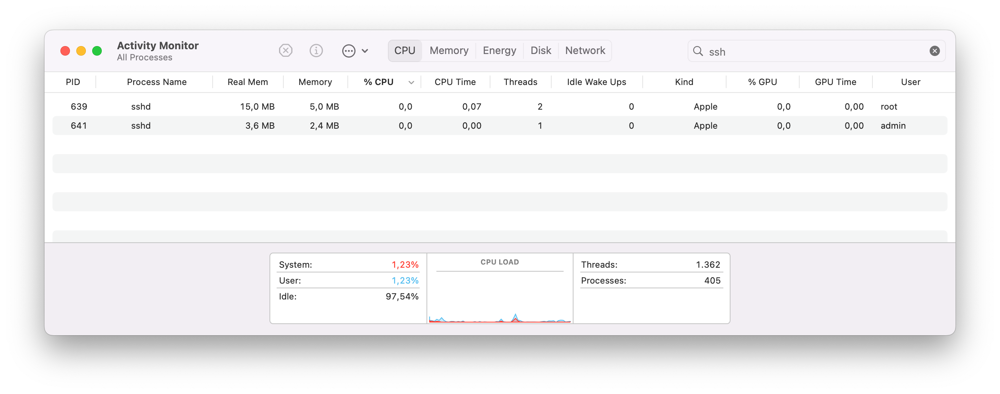

## Introduction

Imagine you opened Activity Monitor to check how much memory your application consumes.




But wait, which number should you actually look at? Suppose there's "Memory" showing 800 MB, and "Real Memory" showing 1 GB. What's the difference?

This exact scenario happened to me more times than I'd like to admit. As someone who keeps Activity Monitor perpetually open, I found myself constantly puzzled by these two memory metrics. Coming from a Linux background where RSS (Resident Set Size) tells a straightforward story, macOS's dual memory reporting felt like reading tea leaves.

When building desktop applications, users inevitably notice high memory usage and start asking tough questions. "Why does your app use so much memory?" becomes a lot harder to answer when you're not entirely sure what the numbers mean yourself.

In this post, I'll describe my findings – how you can programmatically read Memory and Real Memory metrics and what exactly they mean.

## Peering Behind the Curtain

I assumed Activity Monitor was this monolithic application doing all the heavy lifting of process monitoring. But when I started digging into its internals, it turns out Activity Monitor is just the tip of the iceberg. The real work happens in a background process called `sysmond` – the system monitor daemon. Activity Monitor simply uses a system library called `libsysmond.dylib` to communicate with this daemon through XPC (Inter-Process Communication). `sysmond` handles all the complex process introspection, while multiple clients can tap into that data stream.




There's a `libsysmon.dylib` system library that contains an API to communicate with `sysmond`. It has a fairly simple API surface:

```console
$ dyld_info -exports /usr/lib/libsysmon.dylib
/usr/lib/libsysmon.dylib [arm64e]:
    -exports:
        offset      symbol
        0x335BDDB0  _OBJC_CLASS_$_OS_sysmon_object
        0x335BDD10  _OBJC_CLASS_$_OS_sysmon_request
        0x335BDD60  _OBJC_CLASS_$_OS_sysmon_row
        0x335BDD38  _OBJC_CLASS_$_OS_sysmon_table
        0x335BDD88  _OBJC_METACLASS_$_OS_sysmon_object
        0x335BDDD8  _OBJC_METACLASS_$_OS_sysmon_request
        0x335BDE28  _OBJC_METACLASS_$_OS_sysmon_row
        0x335BDE00  _OBJC_METACLASS_$_OS_sysmon_table
        0x3176DBE8  _SYSMON_XPC_KEY_ATTRIBUTES
        0x3176DBF0  _SYSMON_XPC_KEY_FLAGS
        0x3176DBE0  _SYSMON_XPC_KEY_TYPE
        0x3176DC00  _SYSMON_XPC_REPLY_KEY_HEADER
        0x3176DC08  _SYSMON_XPC_REPLY_KEY_TABLE
        0x3176DBF8  _SYSMON_XPC_REPLY_KEY_TIMESTAMP
        0x3176DBD8  _SYSMON_XPC_SERVICE_NAME
        0x00001908  __sysmon_build_reply_with_diff
        0x00000A7C  _sysmon_release
        0x00000B90  _sysmon_request_add_attribute
        0x00000CCC  _sysmon_request_add_attributes
        0x00001700  _sysmon_request_alloc
        0x000012E0  _sysmon_request_cancel
        0x00000A80  _sysmon_request_create
        0x00000B58  _sysmon_request_create_with_error
        0x00000D7C  _sysmon_request_execute
        0x00000D24  _sysmon_request_set_flags
        0x00000D2C  _sysmon_request_set_interval
        0x00000A78  _sysmon_retain
        0x00001768  _sysmon_row_alloc
        0x000014E4  _sysmon_row_apply
        0x0000141C  _sysmon_row_get_value
        0x00001734  _sysmon_table_alloc
        0x000013B8  _sysmon_table_apply
        0x000013AC  _sysmon_table_copy_row
        0x00001390  _sysmon_table_get_count
        0x000013A0  _sysmon_table_get_row
        0x00001398  _sysmon_table_get_timestamp
```

The key functions are:

- `sysmon_request_create()` - Creates a new data request and accepts a callback that will be executed when the request completes
- `sysmon_request_add_attribute()` - Specifies what data you want (memory, CPU, etc.)
- `sysmon_request_execute()` - Fires off the request and gets results
- `sysmon_table_get_count()` - Tells you how many processes were found
- `sysmon_row_get_value()` - Extracts specific values from the results

You build a request by specifying which attributes you want for each process, execute it, and get back a table of results. By analyzing Activity Monitor, I discovered that our mysterious Memory and Real Memory metrics correspond to attribute codes `0x16` and `0x42`, respectively. The [full list of sysmond attributes](https://github.com/bazhenov/task_info_memexp/blob/master/sysmon.md) and corresponding library calls is available on GitHub.

My first thought was that I could use those functions to read memory metrics directly from sysmond and bypass Activity Monitor entirely. And this is possible... sort of. I wrote a simple [proof-of-concept](https://github.com/bazhenov/task_info_memexp/blob/master/sysmon.c) to validate my theory.

```console
$ ./sysmon
  PID comm    Memory   Real Memory
 [...]
 1425 sshd      4.0M          2.8M
 1423 sshd     15.1M          5.0M
 [...]
```




The numbers matched Activity Monitor perfectly, but there is a catch. Only processes with the special `com.apple.sysmond.client` entitlement can connect to `sysmond`. Even if I tried to sign my executable with this entitlement, macOS would unceremoniously kill it during loading:

```
Restricted entitlements not validated, bailing out.
Error:
  Error Domain=AppleMobileFileIntegrityError
        Code=-420 "The signature on the file is invalid"
        UserInfo={
          NSURL=<private>,
          NSLocalizedDescription=The signature on the file is invalid
        }
```

This was Apple's security model doing its job – preventing arbitrary code from accessing system monitoring data. You need to disable SIP (System Integrity Protection) and AMFI ([Apple Mobile File Integrity](https://theapplewiki.com/wiki/AppleMobileFileIntegrity)) to run this example, but that's not something I'd recommend outside of a virtual machine. The `libsysmond` route was effectively a dead-end.

But there's always another way in. When I dug deeper into `sysmond` itself, I discovered something interesting: it wasn't performing any magical kernel-level operations. Instead, it was using two standard library functions that any process can call: `proc_pidinfo()` and `proc_pid_rusage()`.

|                     | Memory                              | Real Memory                     |
| ------------------- | ----------------------------------- | ------------------------------- |
| sysmond code        | 0x42                                | 0x16                            |
| system library call | `proc_pid_rusage()`                 | `proc_pidinfo()`                |
| data field          | `rusage_info_v2::ri_phys_footprint` | `proc_taskinfo::resident_size`  |

These functions are available to any process for reading information about other processes running under the same user account – no special entitlements required. I could access the same memory data that Activity Monitor displays. Even better, `proc_pid_rusage()` alone provides both memory metrics:

```c
#include <mach/task_info.h>
#include <sys/proc_info.h>
#include <libproc.h>

int main(void) {
    struct rusage_info_v6 rusage;
    proc_pid_rusage(pid, RUSAGE_INFO_V6, (rusage_info_t)&rusage);
    rusage.ri_resident_size  // Real memory
    rusage.ri_phys_footprint // Memory
}
```

When I found it and started searching for documentation on the `proc_pid_rusage` function, I realized I'd essentially "discovered" something that Apple has been [publicly documenting and recommending](https://developer.apple.com/videos/play/wwdc2022/10106/?time=427) for years. It was a classic case of reinventing the wheel, but the journey taught me far more than simply reading the documentation would have.

However, I still had the original question: what do these numbers actually represent?

## Following the Trail to the Source

To understand what these memory metrics actually represent, we need to go deeper – all the way to the kernel level. Fortunately, Apple open-sources significant portions of macOS, including the kernel's memory management code.

In [`osfmk/kern/bsd_kern.c`](https://github.com/apple-oss-distributions/xnu/blob/e3723e1f17661b24996789d8afc084c0c3303b26/osfmk/kern/bsd_kern.c):

```c
void
fill_taskprocinfo(task_t task, struct proc_taskinfo_internal * ptinfo)
{
  // ...
  ledger_get_balance(task->ledger, task_ledgers.phys_mem, (ledger_amount_t *) &ptinfo->pti_resident_size);
  // ...
}
// ...
uint64_t
get_task_phys_footprint(task_t task)
{
	return get_task_ledger_balance(task, task_ledgers.phys_footprint);
}
```

Real Memory and Memory are simply values read from two kernel ledgers called `physmem.phys_mem` and `physmem.phys_footprint`.

|                         | Memory                    | Real Memory         |
| ----------------------- | ------------------------- | ------------------- |
| sysmond code            | 0x42                      | 0x16                |
| ledger                  | `physmem.phys_footprint`  | `physmem.phys_mem`  |

But what exactly are these "ledgers"?

## The Kernel's Accounting System

Ledgers are the kernel's accounting system – every time your process allocates memory, maps a file, or performs certain operations, the kernel updates various ledgers using `ledger_debit()` and `ledger_credit()` functions. The [full list of ledgers](https://github.com/apple-oss-distributions/xnu/blob/e3723e1f17661b24996789d8afc084c0c3303b26/osfmk/kern/task.c#L305-L370) is available in the sources.

This system allows the kernel to answer questions like "How much memory is this process using?" in constant time – no need to walk through complex data structures or perform expensive calculations.

I discovered that there's actually a [`ledger()` syscall](https://github.com/apple-oss-distributions/xnu/blob/e3723e1f17661b24996789d8afc084c0c3303b26/bsd/kern/sys_generic.c#L2246-L2252) that can read these values directly. Apple's engineers even left a comment in the code saying it ["isn't meant for civilians to use"](https://github.com/apple-oss-distributions/xnu/blob/e3723e1f17661b24996789d8afc084c0c3303b26/osfmk/kern/ledger.c#L2517-L2519) – which naturally made me want to use it right away 😁.

I created a simple program that [reads all ledger values for a given process](https://github.com/bazhenov/task_info_memexp/blob/master/ledger.c):

```console
$ ledger $$
      GROUP LEDGER                                   BALANCE       CREDIT        DEBIT UNITS
      sched cpu_time                                 4881264      4881264            0 ns
    physmem tkm_private                               327680       327680            0 bytes
    physmem tkm_shared                                     0            0            0 bytes
    physmem phys_mem                                 8765440     68943872     60178432 bytes
    physmem wired_mem                                      0            0            0 bytes
    physmem conclave_mem                                   0            0            0 bytes
    physmem internal                                 6930432      6930432            0 bytes
   mappings iokit_mapped                                   0            0            0 bytes
    physmem alternate_accounting                       16384        16384            0 bytes
    physmem alternate_accounting_compressed                0            0            0 bytes
    physmem page_table                                345344       345344            0 bytes
    physmem phys_footprint                           8783104      8783104            0 bytes
    physmem internal_compressed                      1507328      6406144      4898816 bytes
    physmem reusable                                   49152        49152            0 bytes
    physmem external                                 1785856      1785856            0 bytes
    physmem purgeable_volatile                             0            0            0 bytes
    physmem purgeable_nonvolatile                      16384        16384            0 bytes
    physmem purgeable_volatile_compress                    0            0            0 bytes
    physmem purgeable_nonvolatile_compress                 0            0            0 bytes
    physmem pages_grabbed                               3981         3981            0 count
    physmem pages_grabbed_kern                             2            2            0 count
    physmem pages_grabbed_iopl                             0            0            0 count
    physmem pages_grabbed_upl                            102          102            0 count
    physmem tagged_nofootprint                             0            0            0 bytes
    physmem tagged_footprint                               0            0            0 bytes
    physmem tagged_nofootprint_compressed                  0            0            0 bytes
    physmem tagged_footprint_compressed                    0            0            0 bytes
    physmem network_volatile                               0            0            0 bytes
    physmem network_nonvolatile                            0            0            0 bytes
    physmem network_volatile_compressed                    0            0            0 bytes
    physmem network_nonvolatile_compressed                 0            0            0 bytes
    physmem media_nofootprint                              0            0            0 bytes
    physmem media_footprint                                0            0            0 bytes
    physmem media_nofootprint_compressed                   0            0            0 bytes
    physmem media_footprint_compressed                     0            0            0 bytes
    physmem graphics_nofootprint                           0            0            0 bytes
    physmem graphics_footprint                             0            0            0 bytes
    physmem graphics_nofootprint_compressed                0            0            0 bytes
    physmem graphics_footprint_compressed                  0            0            0 bytes
    physmem neural_nofootprint                             0            0            0 bytes
    physmem neural_footprint                               0            0            0 bytes
    physmem neural_nofootprint_compressed                  0            0            0 bytes
    physmem neural_footprint_compressed                    0            0            0 bytes
    physmem neural_nofootprint_total                       0            0            0 bytes
      power platform_idle_wakeups                          0            0            0 count
      power interrupt_wakeups                              3            5            2 count
        sfi SFI_CLASS_DARWIN_BG                            0            0            0 MATUs
        sfi SFI_CLASS_APP_NAP                              0            0            0 MATUs
        sfi SFI_CLASS_MANAGED                              0            0            0 MATUs
        sfi SFI_CLASS_DEFAULT                              0            0            0 MATUs
        sfi SFI_CLASS_OPTED_OUT                            0            0            0 MATUs
        sfi SFI_CLASS_UTILITY                              0            0            0 MATUs
        sfi SFI_CLASS_LEGACY                               0            0            0 MATUs
        sfi SFI_CLASS_USER_INITIATED                       0            0            0 MATUs
        sfi SFI_CLASS_USER_INTERACTIVE                     0            0            0 MATUs
        sfi SFI_CLASS_MAINTENANCE                          0            0            0 MATUs
      sched cpu_time_billed_to_me                      24757        24757            0 ns
      sched cpu_time_billed_to_others                      0            0            0 ns
        res physical_writes                            57344        57344            0 bytes
        res logical_writes                            229376       229376            0 bytes
        res logical_writes_to_external                     0            0            0 bytes
        res fs_metadata_writes                        114688       114688            0 bytes
      power energy_billed_to_me                       136969       136969            0 nj
      power energy_billed_to_others                        0            0            0 nj
    physmem memorystatus_dirty_time                        0            0            0 ns
    physmem swapins                                        0            0            0 bytes
```

By examining the kernel's memory management code in [`osfmk/arm64/sptm/pmap/pmap.c`](https://github.com/apple-oss-distributions/xnu/blob/e3723e1f17661b24996789d8afc084c0c3303b26/osfmk/x86_64/pmap.c), I could finally understand what these ledgers actually track:

- **`phys_mem`** gets updated every time a page is added or removed from physical RAM and the process's page table. This is macOS's version of Linux's RSS (Resident Set Size) – memory that's actually sitting in physical RAM right now. However, most of the shared system libraries (dyld cache) don't count toward this ledger, except for dirty pages that the process has modified.

- **`phys_footprint`** is far more complex. To understand it, I needed to step back and explain why `phys_mem` alone isn't sufficient for understanding a process's true memory impact.

## The Problem with RSS

One might think that Real Memory (macOS's equivalent to Linux's RSS) would be perfect for monitoring memory usage. It represents physical RAM that's actually being used right now – what could be more straightforward? But there are two fundamental problems that make RSS-style metrics misleading:

**Problem 1: Not all resident memory is truly "yours"**

Some memory that appears in your process's RSS is actually shared with other processes and therefore cannot be accounted solely to one process. Some memory is designed to be reclaimed by the system at any time; therefore, it does not contribute toward memory pressure on the system.

**Problem 2: Not all your memory is resident**

Some of your application's memory might be compressed or swapped to disk, but it's still your application's memory – you just don't see it in RSS.

Memory accounting becomes especially confusing when you consider several categories of "sort of yours" memory:

- **Memory-mapped files**: When you map a file with `MAP_SHARED`, that memory can be shared across multiple processes. The OS technically owns it, even though your process is the only one using it.
- **Reclaimable memory**: When you free memory, macOS might not immediately return it to the kernel. It leaves it in your process space for potential reuse, similar to Linux's `madvise(MADV_FREE)`.
- **System libraries (dyld cache)**: This is the big one, and it deserves special attention.

### The dyld Cache: macOS's Memory Optimization Trick

Here's where macOS gets interesting. Unlike Linux, which provides a stable syscall interface, macOS provides stability through a collection of system libraries (`libsystem_c.dylib`, `libsystem_malloc.dylib`, etc.). Since every process needs these libraries, Apple devised an optimization called the dyld cache.

Instead of each process loading dozens of system libraries individually, the system pre-links all these libraries into a single, massive memory region (the dyld cache found in `/System/Cryptexes/OS/System/Library/dyld/`). This cache gets mapped into every new process in a single operation (this is rather a simplification; for more details, see [Apple's documentation](https://developer.apple.com/library/archive/documentation/Darwin/Conceptual/KernelProgramming/vm/vm.html)).

Here's the catch: this dyld cache is several hundred megabytes in size, and most of it is resident in physical RAM. This means that even a simple "Hello World" program appears to use over 100MB of RAM if you look at traditional RSS metrics – enough to sound alarm bells for any developer or user.

Apple's solution was to exclude most of the dyld cache from the `phys_mem` ledger, counting only the dirty pages (like modified `__DATA` segments) that the process has actually changed. This makes perfect sense from a developer's perspective – you don't consider system libraries as "your" memory, so why should they count against your application's memory usage?


I found one interesting byproduct of how things are implemented in macOS: virtual addresses of all system libraries are the same across all macOS processes. This means that the dyld cache ASLR slide changes only after reboot. As far as I understand, this makes ASLR somewhat less effective, since it becomes easy to predict the address of any system function in any target process. To be fair, it can only be exploited if an attacker can already execute arbitrary code on a target machine, so this probably isn't a huge sacrifice.

```console
$ vmmap $(pgrep -u $(whoami) -x Dock) | grep 'libsystem_c.dylib'
__TEXT                      195af7000-195b79000    [  520K   504K     0K     0K] r-x/r-x SM=COW          /usr/lib/system/libsystem_c.dylib
__DATA_CONST                1fd96a870-1fd96c0c8    [    6K     6K     0K     0K] r--/rw- SM=COW          /usr/lib/system/libsystem_c.dylib
__AUTH_CONST                204e05938-204e062b8    [  2432   2432     0K     0K] r--/rw- SM=COW          /usr/lib/system/libsystem_c.dylib
__DATA                      2017679d0-201769be0    [    9K     9K     9K     0K] rw-/rw- SM=COW          /usr/lib/system/libsystem_c.dylib
__DATA_DIRTY                203d7c6f0-203d7f260    [   11K    11K    11K     0K] rw-/rw- SM=COW          /usr/lib/system/libsystem_c.dylib
__AUTH                      204220070-204220120    [   176    176    176     0K] rw-/rw- SM=COW          /usr/lib/system/libsystem_c.dylib

$ vmmap $(pgrep -u $(whoami) -x WindowManager) | grep 'libsystem_c.dylib'
__TEXT                      195af7000-195b79000    [  520K   504K     0K     0K] r-x/r-x SM=COW          /usr/lib/system/libsystem_c.dylib
__DATA_CONST                1fd96a870-1fd96c0c8    [    6K     6K     0K     0K] r--/rw- SM=COW          /usr/lib/system/libsystem_c.dylib
__AUTH_CONST                204e05938-204e062b8    [  2432   2432     0K     0K] r--/rw- SM=COW          /usr/lib/system/libsystem_c.dylib
__DATA                      2017679d0-201769be0    [    9K     9K     9K     0K] rw-/rw- SM=COW          /usr/lib/system/libsystem_c.dylib
__DATA_DIRTY                203d7c6f0-203d7f260    [   11K    11K    11K     0K] rw-/rw- SM=COW          /usr/lib/system/libsystem_c.dylib
__AUTH                      204220070-204220120    [   176    176    176     0K] rw-/rw- SM=COW          /usr/lib/system/libsystem_c.dylib
```



### The Swapped Memory Problem

The other fundamental issue with `phys_mem` is that it completely ignores swapped and compressed memory. When the system runs low on RAM, it can compress or swap out your application's memory to disk. By definition, this memory is no longer resident, so it disappears from RSS-style metrics.

But here's the thing: it's still your application's memory. As a developer, you should be aware of your total memory footprint, not just the portion that happens to be in RAM at any given moment. Under memory pressure, your seemingly "lightweight" application might actually be consuming significant resources through compressed or swapped memory.

This is why Apple developed the `phys_footprint` ledger – to give developers a more complete picture of their application's true memory impact.

### Decoding the Memory Footprint Formula

There's a [formula for the `phys_footprint` ledger](https://github.com/apple-oss-distributions/xnu/blob/e3723e1f17661b24996789d8afc084c0c3303b26/osfmk/kern/task.c#L1180-L1214) in the kernel sources:

```
phys_footprint =
    + (internal - alternate_accounting)
    + (internal_compressed - alternate_accounting_compressed)
    + iokit_mapped
    + purgeable_nonvolatile
    + purgeable_nonvolatile_compressed
    + page_table
```

`phys_footprint` includes **all** your application's memory, regardless of whether it's currently in RAM, compressed, or swapped. It represents your true memory footprint.

The "alternate accounting" components exist to prevent double-counting. Since IOKit memory is also considered internal memory, adding them together would overcount the total allocation. The alternate accounting ledgers track this overlap, allowing the system to provide an accurate final number.

Here is the table that describes different types of memory and in which ledger they are present.

| Memory type                                               | Real Memory | Memory                |
| --------------------------------------------------------- | ----------- | ----------------------|
| dyld cache read-only segments (`__TEXT`)                  | no          | no                    |
| Heap allocated memory (`malloc()`, `mmap(MAP_ANONYMOUS)`) | yes[^1]     | yes                   |
| Stack allocated memory (`alloca()`)                       | yes[^1]     | yes                   |
| Files mmapped with `MAP_SHARED`                           | yes[^1]     | no                    |
| Files mmapped with `MAP_PRIVATE`                          | yes[^1]     | yes                   |
| dyld cache read-write segments (`__DATA`, `__AUTH`)       | yes, if changed (COW)     | yes, if changed (COW) |
| Reclaimed memory                                          | yes[^1]     | no                    |
| purgeable nonvolatile                                     | yes[^1]     | yes                   |
| purgeable volatile                                        | yes[^1]     | no                    |

## The Final Picture

**Real Memory** corresponds to the `phys_mem` ledger and represents physical RAM currently occupied by your process. Think of it as macOS's version of Linux's RSS, but with a crucial improvement: it excludes most of the shared system libraries (dyld cache), counting only the dirty pages your process has actually modified.

**Memory** corresponds to the `phys_footprint` ledger and tells the complete story of your application's memory impact. It includes:

- All internal (anonymous) memory, whether resident, compressed, or swapped
- IOKit-allocated memory on behalf of your process
- Non-volatile purgeable memory
- Page tables (usually negligible)

The key insight: **Memory** represents your application's total memory footprint regardless of where that memory currently lives, while **Real Memory** only shows what's physically in RAM right now. Both metrics exclude shared system components.

**For developers:** Focus on the **Memory** metric when optimizing. It provides the complete picture of your application's memory consumption and won't fluctuate based on system memory pressure.

Both metrics are accessible programmatically using `proc_pid_rusage()` with the `ri_phys_footprint` and `ri_resident_size` fields – no special entitlements required.

[^1]: Only present in Real Memory if it is not compressed or swapped out right now
